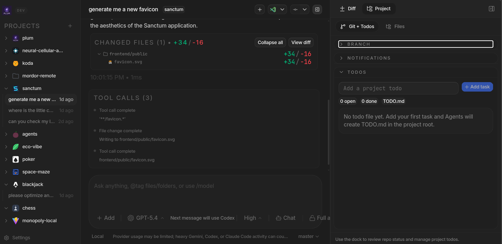
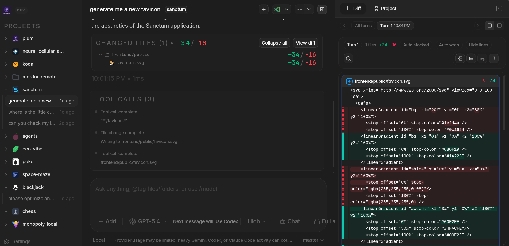
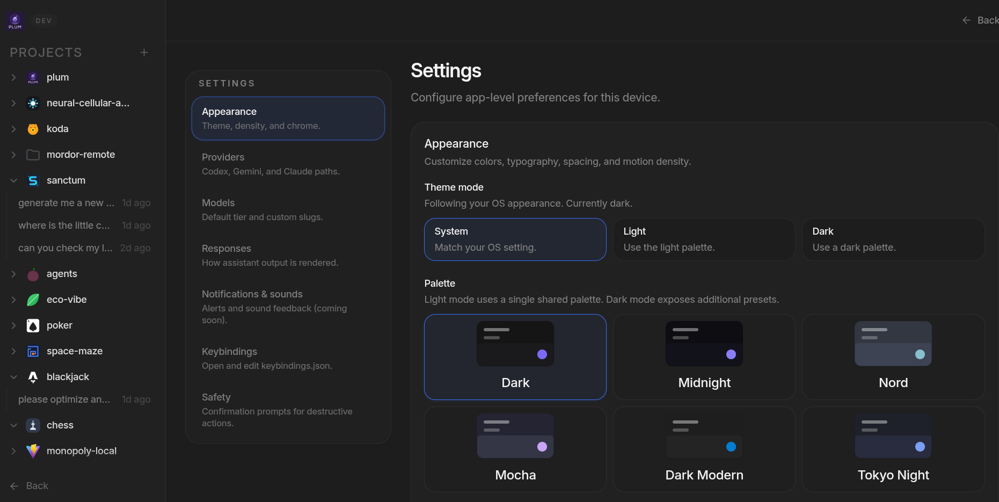

# Agents

Agents is a multi-provider coding-agent manager with web and desktop frontends. It brings Codex, Claude, and Gemini workflows into one place, with project-scoped threads, diff review, and session tooling designed for fast iteration and dependable long-running work.

## Highlights

- Unified agent workspace for Codex, Claude, and Gemini
- Project-scoped threads, tool activity, and diff review in one interface
- Electron desktop app as the native client

## Screenshots

<p align="center">
  <a href="./assets/screenshots/todo-ui.png">
    
  </a>
</p>

Main project view with conversation history, changed files, tool-call logging, and the project todo dock. Click for the full-resolution image.

<p align="center">
  <a href="./assets/screenshots/diff-ui.png">
    
  </a>
</p>

Diff-focused workspace with file-level patch review alongside the active thread. Click for the full-resolution image.

<p align="center">
  <a href="./assets/screenshots/settings-ui.png">
    
  </a>
</p>

Settings surface for appearance, palette, density, and sidebar tuning. Click for the full-resolution image.

## Quick start

```bash
bun install
bun run dev
```

Desktop targets:

```bash
bun run dev:desktop
```

## Repo layout

- `apps/web`: React and Vite browser UI
- `apps/server`: WebSocket and provider backend services
- `apps/desktop/electron`: Electron desktop shell
- `packages/contracts`: shared schemas and protocol contracts
- `packages/shared`: shared runtime utilities

## Notes

- Bun `1.3.9+` and Node `24.10+` are expected.
- Codex, Claude, and Gemini each may require local CLIs, API credentials, or provider-specific configuration before use.
- This repository is still an early work in progress, with a bias toward performance, reliability, and predictable recovery during reconnects or session restarts.
